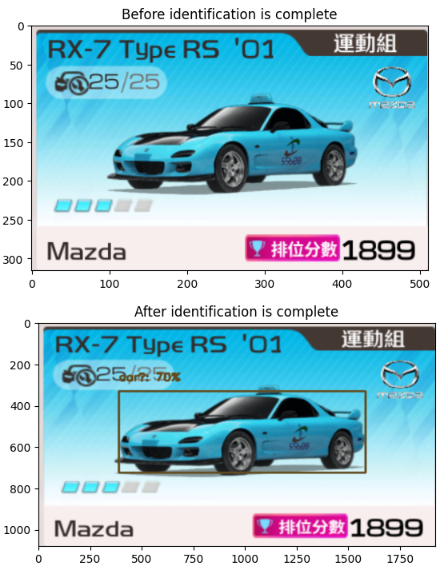

# 影像辨識(車用物件偵測)
使用tensorflow_object_detection進行設計改良

  

<h4 alaign="center">目前問題:顏色會跑掉</h4>

影像辨識在車用物件偵測中扮演著重要角色，特別是在自駕車系統中。透過影像辨識，車輛能夠識別道路上的各種物體，如行人、其他車輛、交通標誌及障礙物，進而做出駕駛決策。使用 TensorFlow 的 tensorflow_object_detection API，這一過程變得更加高效和精確。這個工具包提供了預訓練的模型，可以用來檢測不同的物體，並且支援自訂模型訓練，根據特定的需求進行調整。

tensorflow_object_detection 利用卷積神經網絡 (CNN) 來分析影像，識別物體的類別和位置，並回傳邊界框 (bounding box) 及信心分數。在車用物件偵測中，這些模型能夠在實時影像中準確識別目標物體，並進行追蹤。隨著深度學習技術的進步，這些系統的準確度和反應速度已經達到可用於實際駕駛的水準，為車輛安全提供了強有力的支持。  

